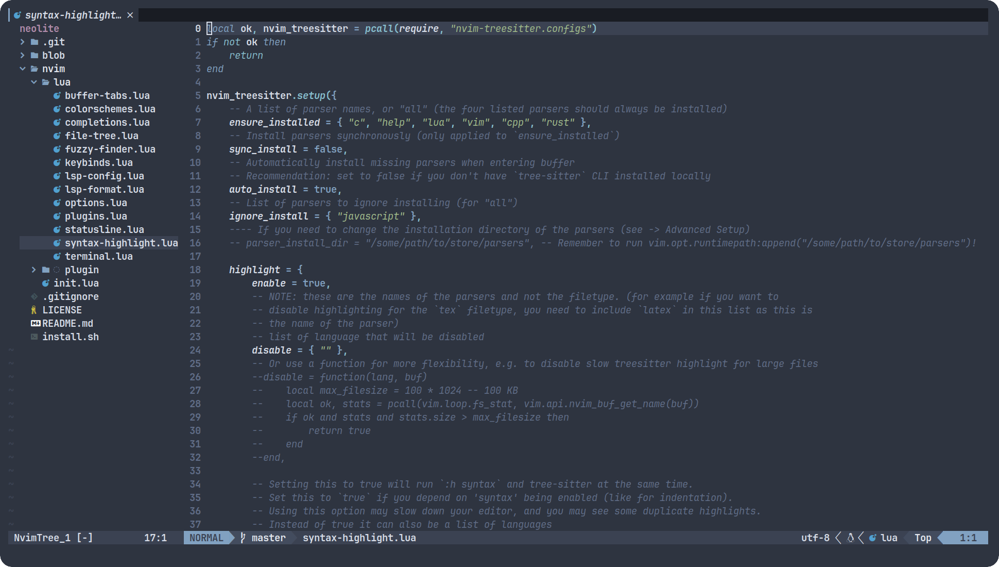
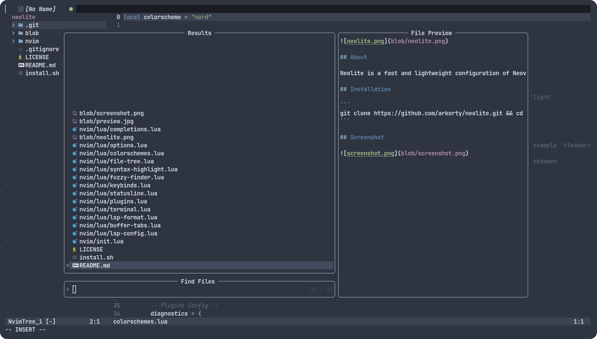
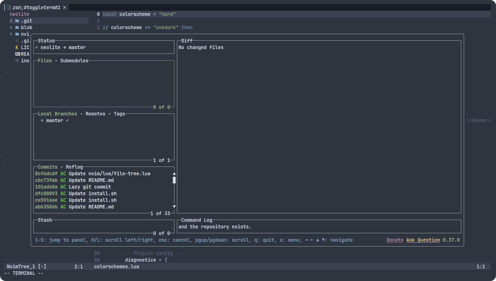
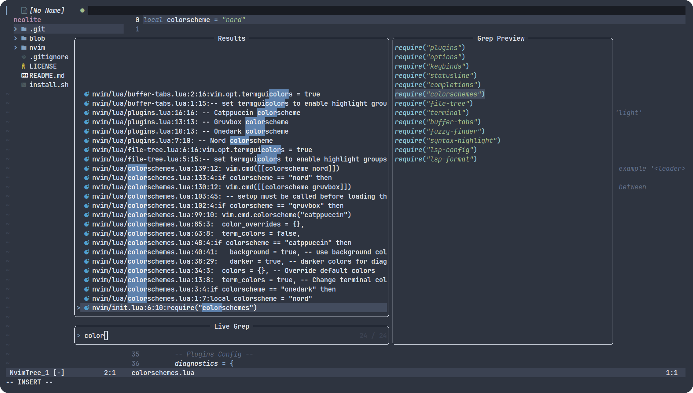

## About

Neolite is a fast and lightweight configuration of Neovim.

## Quick Start

```
curl -sLf https://raw.githubusercontent.com/arkorty/neolite/master/install.sh | bash
```

## Screenshots

### File Tree & Active Buffer



### Fuzzy Finder



### Terminal & Lazygit



### Live Grep



## Optional

- [Lazygit](https://github.com/jesseduffield/lazygit)

## License

- [MIT License](LICENSE)
