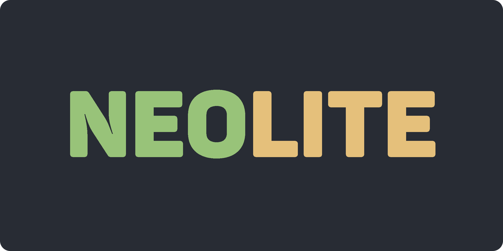

# About

Neolite is a fast and lightweight configuration of Neovim. For the uninitiated, Neovim is a terminal based text editor which can be extended using the [Lua](https://www.lua.org/about.html) scripting language. Neovim out-of-the-box doesn't come with a lot of features, but it is highly extensible. It comes with native LSP support (lets your IDE do all that auto-completion magic). Vim has been in use since forever, so you don't have to worry about the project going stale anytime soon.

You also have the added benefit of becoming a true Vim chad once you start using Neovim instead of some web browser (ahem.. VS Code) disguised as an IDE.

# Installation

##### Arch Linux

```bash
sudo pacman -S git neovim make unzip gcc npm
```

##### Debian/Ubuntu

```bash
sudo apt install git neovim make unzip gcc npm
```

##### Fedora/RHEL

```bash
sudo dnf install git neovim make unzip gcc npm
```

##### Clone Repository

```bash
git clone https://github.com/arkorty/Neolite.git ~/.config/nvim
```

# License

- [MIT License](LICENSE)
